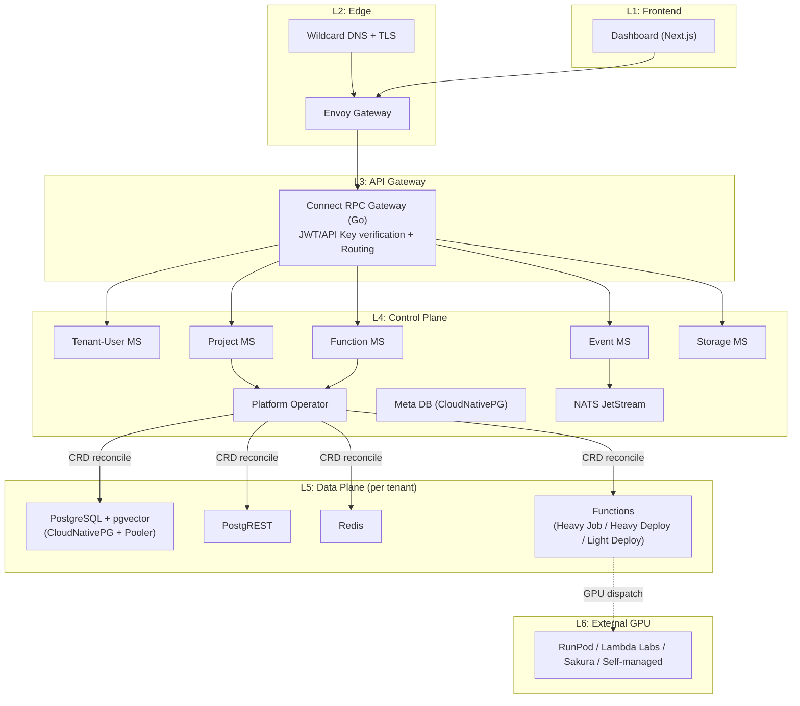

# EtalBaaS

**The polyglot, multi-provider AI BaaS — bring your own GPU, your own language, your own cloud.**

> The philosophy of Supabase × the execution power of Modal × the flexibility of Kubernetes

> [!WARNING]
> This project is currently an **MVP (Phase 1)**. Core features are functional but the platform is under active development. Expect breaking changes.

## What is EtalBaaS?

EtalBaaS is a fully integrated, self-hostable Backend-as-a-Service platform purpose-built for AI workloads. It combines database, auth, storage, serverless functions, and realtime capabilities into a single Kubernetes-native platform — with first-class GPU support across any provider.

### Why EtalBaaS?

Every existing platform makes you choose: Supabase gives you an integrated BaaS but no GPU. Modal gives you GPU but no database. Cloudflare locks you into TypeScript and their own GPUs. EtalBaaS is the only platform that fills this structural gap:

- **Any language** — Python, TypeScript, Go, Rust, or any language that runs in a container. No V8 isolate restrictions.
- **Any GPU provider** — RunPod, Lambda Labs, Sakura, CoreWeave, or bring your own GPU (university lab, on-prem, home rig). Switch providers per-function.
- **PostgreSQL + pgvector native** — Use your existing ORMs, BI tools, and ETL pipelines. JOIN vectors with relational data in plain SQL.
- **Fully integrated** — DB, Auth, Storage, Functions, and Realtime in one Kubernetes cluster. No duct-taping separate services.
- **Data sovereignty** — Deploy on-prem, in air-gapped environments, or in any domestic datacenter. Zero dependency on US cloud providers.
- **Complete OSS (Apache 2.0)** — No vendor lock-in. `helm install` and you own your entire stack.

## Architecture

EtalBaaS follows a layered architecture with clear separation between the control plane and per-tenant data plane:



### Components

| Component | Role | Technology |
|-----------|------|------------|
| **Gateway** | JWT/API key verification, routing, tenant header injection | Go + connect-go |
| **Tenant-User MS** | Tenant and user management | Go + connect-go |
| **Project MS** | Project CRUD, lifecycle management | Go + connect-go |
| **Function MS** | Function CRUD, build orchestration | Go + connect-go |
| **Event MS** | Event trigger matching and dispatch | Go + connect-go |
| **Storage MS** | Object storage management (S3-compatible) | Go + connect-go |
| **Platform Operator** | CRD reconciliation, resource provisioning | Go + kubebuilder |
| **Dashboard** | Web UI for project management | Next.js |
| **CDC Pod** | Database change data capture (per-tenant) | Go |
| **NATS Sidecar** | Event bridge between NATS and functions | Go |

## Tech Stack

| Category | Technology | Purpose |
|----------|-----------|---------|
| Frontend | Next.js | Dashboard (in-cluster Pod) |
| API Protocol | Connect RPC (protobuf) | Schema-driven, type-safe APIs |
| Microservices | Go + connect-go | Gateway and all backend services |
| Operator | Go + kubebuilder | Kubernetes CRD controller |
| Auth | GoTrue (Supabase fork) | Authentication (not reinvented) |
| DB API | PostgREST | Auto-generated REST API from Postgres |
| Vector Search | pgvector | Native PostgreSQL extension |
| Meta DB | CloudNativePG | Platform metadata, HA |
| Project DB | CloudNativePG | Per-tenant isolated PostgreSQL |
| Connection Pool | PgBouncer (CloudNativePG Pooler) | Per-tenant connection pooling |
| DB Routing | Envoy Gateway + TLSRoute (SNI) | Direct Postgres connections |
| Cache / Queue | Redis | Per-tenant cache |
| Object Storage | S3-compatible (R2 / MinIO) | File storage with tenant prefix isolation |
| Event Bus | NATS JetStream | Internal pub/sub, exactly-once delivery |
| Function Builder | Kaniko (gVisor-isolated) | Container image builds |
| Function Registry | Zot (R2 backend) | Built image storage |
| GPU Execution | RunPod / Lambda Labs / Sakura / Self-managed | External GPU dispatch |
| Sandbox | gVisor (RuntimeClass) | Kernel-level function isolation |
| Autoscaler | KEDA | Scale-to-zero, event-driven scaling |
| CNI | Cilium (eBPF) | NetworkPolicy, WireGuard encryption |
| Ingress | Envoy Gateway (Gateway API) | HTTP + TLS passthrough |
| GitOps | ArgoCD (App of Apps) | Pull-based deployments |
| Monitoring | Prometheus + Grafana + Loki + Tempo + OTel | Metrics, logs, traces |
| CI | GitHub Actions | Build, scan, sign, push |
| Container Registry | ghcr.io + Cosign | Signed platform images |

## Project Structure

```
etalbaas/
├── proto/                       # Protocol Buffers definitions
│   ├── buf.yaml
│   ├── buf.gen.yaml
│   └── etalbaas/
│       ├── common/v1/           # Shared types (pagination, timestamps)
│       ├── tenant/v1/           # Tenant & user management
│       ├── project/v1/          # Project CRUD & lifecycle
│       ├── function/v1/         # Function CRUD & invocation
│       ├── event/v1/            # Event trigger management
│       ├── secret/v1/           # Secret management
│       └── storage/v1/          # Object storage operations
├── services/                    # Go microservices
│   ├── gateway/                 # API Gateway (JWT, routing)
│   ├── tenant-user/             # Tenant-User MS
│   ├── project/                 # Project MS
│   ├── function/                # Function MS
│   ├── event/                   # Event MS
│   ├── storage/                 # Storage MS
│   ├── cdc-pod/                 # Per-tenant CDC processor
│   └── nats-sidecar/            # NATS ↔ Function bridge
├── operator/                    # Kubernetes Operator (Project/Function CRDs)
├── dashboard/                   # Next.js frontend
├── deploy/
│   ├── helm/etalbaas/           # Helm chart for self-host deployment
│   ├── migrations/meta/         # Meta DB migrations (golang-migrate)
│   └── argocd/                  # GitOps (App of Apps)
└── docs/
    ├── architecture.md          # Full architecture document
    └── database.md              # Meta DB schema design
```

## Getting Started

### Prerequisites

- Go 1.26+
- Node.js 20+
- Docker
- [Kind](https://kind.sigs.k8s.io/) (for local development)
- [Helm](https://helm.sh/) 3.x
- [kubectl](https://kubernetes.io/docs/tasks/tools/)
- [buf](https://buf.build/) (for proto generation)

### Local Development

```bash
# 1. Create a Kind cluster
kind create cluster --name etalbaas

# 2. Install infrastructure dependencies (CloudNativePG, NATS, etc.)
kubectl apply -f deploy/local/infra.yaml

# 3. Run meta DB migrations
cd deploy/migrations/meta
migrate -path . -database "$META_DB_URL" up

# 4. Install EtalBaaS via Helm
helm install etalbaas deploy/helm/etalbaas/ \
  --namespace platform-system \
  --create-namespace \
  -f deploy/helm/etalbaas/values-local.yaml

# 5. Access the dashboard
kubectl port-forward -n platform-system svc/etalbaas-dashboard 3000:3000
# Open http://localhost:3000
```

### Running Tests

```bash
# Proto lint
cd proto && buf lint

# Proto generate
cd proto && buf generate

# Go tests (per service)
cd services/<service-name> && go test ./...

# Helm lint
helm lint deploy/helm/etalbaas/
```

## Production Deployment

Production deployment uses kubespray for Kubernetes bootstrapping and a deploy script for configuration:

```bash
# Full deployment (cluster setup → bootstrap → secrets → Helm)
bash deploy/scripts/deploy.sh all

# Individual stages
bash deploy/scripts/deploy.sh cluster    # kubespray k8s setup
bash deploy/scripts/deploy.sh bootstrap  # ArgoCD, Sealed Secrets
bash deploy/scripts/deploy.sh seal       # Seal secrets
```

All changes follow a GitOps workflow: local edit → git push → ArgoCD sync. See `deploy/` for detailed documentation.

## CRDs

EtalBaaS uses Kubernetes Custom Resource Definitions (API group: `etalbaas.io/v1alpha1`) to manage tenant infrastructure declaratively.

### Project

A Project represents a tenant's isolated environment with its own database, cache, and API endpoints:

```yaml
apiVersion: etalbaas.io/v1alpha1
kind: Project
metadata:
  name: my-project
  namespace: platform-system
spec:
  displayName: "My AI App"
  plan: free
  stack:
    postgres:
      enabled: true
      version: "16"
      extensions: ["pgvector", "pg_stat_statements"]
      storage: "10Gi"
    redis:
      enabled: true
    postgrest:
      enabled: true
  networking:
    subdomain: "xk7a9bc2"
```

### Function

A Function defines a serverless workload with support for HTTP, storage, and database change triggers:

```yaml
apiVersion: etalbaas.io/v1alpha1
kind: Function
metadata:
  name: image-generator
  namespace: project-xk7a9bc2
spec:
  projectRef:
    name: my-project
  kind: heavy-job
  source:
    type: git
    git:
      repo: https://github.com/user/image-gen
      ref: main
  runtime:
    preset: "python-3.11-ml"
    requirements: ["torch", "diffusers"]
  gpu:
    required: true
    type: A100
    provider: runpod
  triggers:
    - type: Http
      http:
        path: /generate
    - type: DatabaseChange
      databaseChange:
        table: generation_requests
        operations: ["INSERT"]
```

**Function kinds:**

| Kind | Execution | Use Case |
|------|-----------|----------|
| `heavy-job` | Kubernetes Job (scale-to-zero) | GPU inference, batch processing, long-running tasks |
| `heavy-deployment` | Deployment (scale-to-zero via KEDA) | Stateful GPU services, model serving |
| `light-deployment` | Deployment (always-on) | Low-latency APIs, webhooks |

## API

All services expose [Connect RPC](https://connectrpc.com/) APIs defined in Protocol Buffers. Connect supports gRPC, gRPC-Web, and simple HTTP/JSON from a single definition.

### Proto Domains

| Domain | Package | Description |
|--------|---------|-------------|
| Common | `etalbaas.common.v1` | Shared types (pagination, timestamps) |
| Tenant | `etalbaas.tenant.v1` | Tenant & user management, API keys |
| Project | `etalbaas.project.v1` | Project CRUD, lifecycle, stack config |
| Function | `etalbaas.function.v1` | Function CRUD, invocation, build status |
| Event | `etalbaas.event.v1` | Event trigger registration & management |
| Secret | `etalbaas.secret.v1` | Encrypted secret management |
| Storage | `etalbaas.storage.v1` | Object storage operations, presigned URLs |

Proto definitions are in `proto/etalbaas/` and code is generated with `buf generate`.

## License

[Apache License 2.0](LICENSE)
