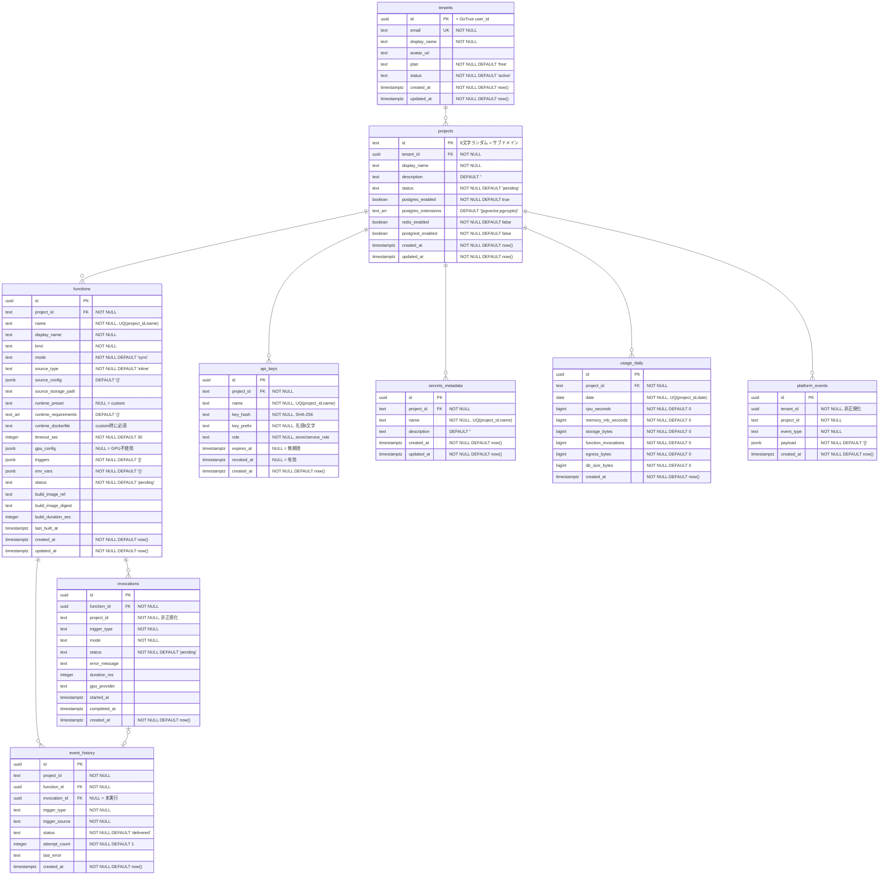

# Meta Database Design

メタDB（platform-system 用 PostgreSQL）のスキーマ設計。
テナントプロジェクト DB（project-{id} NS 内の CloudNativePG）とは別。

## 設計方針

- **PK**: UUID v7（アプリ側生成、時系列ソート可能）
- **project_id**: ランダム8文字 text（サブドメインと同一）
- **tenant_id**: GoTrue user_id（UUID）
- **Soft delete**: status カラムで管理（物理削除しない）
- **Enum**: text + CHECK 制約（PG enum は ALTER TYPE が面倒）
- **タイムスタンプ**: 全テーブル created_at / updated_at（trigger で自動更新）
- **JSONB**: 構造が可変なフィールドに限定使用（trigger config, gpu config 等）
- **マイグレーション**: golang-migrate, `deploy/migrations/meta/` に配置

## ER関係

```
tenants 1──N projects
              ├── 1──N functions
              │        ├── 1──N invocations
              │        └── 1──N event_history
              ├── 1──N api_keys
              ├── 1──N secrets_metadata
              ├── 1──N usage_daily
              └── 1──N platform_events
```

## スキーマ定義



## CHECK 制約

| テーブル | カラム | 許可値 |
|---------|--------|--------|
| tenants | plan | `free`, `pro`, `enterprise` |
| tenants | status | `active`, `suspended`, `deleted` |
| projects | status | `pending`, `provisioning`, `ready`, `paused`, `failed`, `deleted` |
| projects | postgrest_enabled | `NOT (postgrest_enabled AND NOT postgres_enabled)` |
| api_keys | role | `anon`, `service_role` |
| functions | kind | `heavy-job`, `heavy-deployment`, `light-deployment` |
| functions | mode | `sync`, `async`, `stream` |
| functions | source_type | `git`, `zip`, `inline` |
| functions | status | `pending`, `building`, `ready`, `failed`, `deleted` |
| functions | runtime | `(preset IS NULL AND dockerfile IS NOT NULL) OR (preset IS NOT NULL AND dockerfile IS NULL)` |
| invocations | trigger_type | `http`, `database_change`, `object_storage` |
| invocations | mode | `sync`, `async`, `stream` |
| invocations | status | `pending`, `running`, `succeeded`, `failed`, `timeout`, `cancelled` |
| event_history | trigger_type | `database_change`, `object_storage` |
| event_history | status | `delivered`, `failed`, `retrying` |

## インデックス

| テーブル | インデックス | 条件 |
|---------|-------------|------|
| projects | `idx_projects_tenant_id(tenant_id)` | |
| projects | `idx_projects_status(status)` | `WHERE status != 'deleted'` |
| api_keys | `idx_api_keys_key_hash(key_hash)` | `WHERE revoked_at IS NULL` |
| api_keys | `idx_api_keys_project_id(project_id)` | |
| functions | `idx_functions_project_id(project_id)` | |
| invocations | `idx_invocations_project_created(project_id, created_at DESC)` | |
| invocations | `idx_invocations_function_created(function_id, created_at DESC)` | |
| event_history | `idx_event_history_project_created(project_id, created_at DESC)` | |
| event_history | `idx_event_history_invocation(invocation_id)` | `WHERE invocation_id IS NOT NULL` |
| platform_events | `idx_platform_events_tenant_created(tenant_id, created_at DESC)` | |
| platform_events | `idx_platform_events_project_created(project_id, created_at DESC)` | |

## 補足設計

### Operator が kind から自動決定する値（DBカラムに持たない）

| kind | 実行方式 | replicas | CPU | Memory |
|------|---------|----------|-----|--------|
| heavy-job | Job (使い捨て) | min=0, max=1 | 1000m | 1Gi |
| heavy-deployment | Deployment (KEDA, scale_down=300s) | min=0, max=10 | 500m | 512Mi |
| light-deployment | Deployment (HPA) | min=1, max=10 | 250m | 256Mi |

### タイムアウト上限（アプリ層バリデーション）

| kind | GPU | 上限 |
|------|-----|------|
| light-deployment | - | 30s |
| heavy-* | CPU のみ | 3600s |
| heavy-* | GPU あり | 無制限 |

### gpu_config JSONB 例

```json
{"type": "H100", "provider": "runpod", "product": "serverless"}
```

NULL の場合は GPU 不使用。

### イベント → 実行フロー

1. イベント発火 → event_history INSERT (`invocation_id = NULL`)
2. Function 実行開始 → invocations INSERT
3. `invocation_id` 確定 → event_history UPDATE
4. `status = failed` でリトライ尽きた場合 → `invocation_id = NULL` のまま（未実行イベントの可視化）

### Secret → Function 紐付け方針

- `linked_function_ids (uuid[])` は不採用（FK制約不可、削除時の配列更新が面倒）
- functions の `env_vars` に Secret 名を記述（例: `{"OPENAI_API_KEY": ""}`）
- Operator が Pod 起動時に k8s Secret から値を注入

### Phase 1 スコープ外

- cron トリガーは実装しない（triggers JSONB にも含めない）
- usage_daily はテーブル作成のみ、集計ロジックは実装しない

## 共通 Trigger（updated_at 自動更新）

```sql
CREATE OR REPLACE FUNCTION update_updated_at()
RETURNS TRIGGER AS $$
BEGIN
  NEW.updated_at = now();
  RETURN NEW;
END;
$$ LANGUAGE plpgsql;
```

対象テーブル: tenants, projects, functions, secrets_metadata
